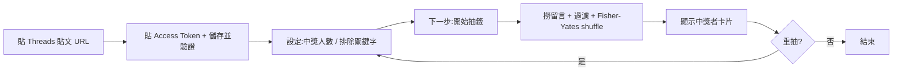

# threads-comment-helper · PRD v3.0.2 等級規格書

> 自動生成：2026-09-06 (v3.0.2 fleet upgrade)
> 對齊 SPEC v3.0 契約（SPEC §1–§19 全部套用）

---

## 1. 產品概述

### 1.1 問題陳述
社群小編、品牌 owner、活動主辦人每天會在 Threads 公開貼文舉辦抽獎活動,但**沒有任何免費工具**能從公開留言中**隨機抽出中獎者**。現有解法都是手動把留言複製到 Google Sheet、用 `=RAND()` 公式抽,或寫一次性 Python 腳本。本工具補上這個工作流缺口:貼 URL、選條件、一鍵抽出中獎者。

### 1.2 目標使用者
| Persona | 工作情境 | 主要任務 |
|---|---|---|
| Primary | Threads 帳號小編 / 個人品牌 owner / 抽獎活動主持人 | 從公開貼文留言抽出 N 位中獎者 |
| Secondary | 商家行銷、podcaster、創作者 | 維護固定抽獎 SOP,需要可重現的工具 |

### 1.3 核心價值主張
> **零後端、零資料外洩、30 秒完成抽獎**。Token 只存你的 localStorage,直接從瀏覽器送 `graph.threads.net`;後端完全看不到 token,完全看不到留言,完全看不到中獎者。

### 1.4 Non-Goals（明確不做）
- ❌ 不做帳號系統（OAuth 由使用者自己走 Threads Graph API 流程）
- ❌ 不做後端代理（純前端 SPA,token 絕不上傳）
- ❌ 不做留言管理 / 刪除 / 檢舉
- ❌ 不做 Threads 自動回覆、發文、定時排程
- ❌ 不做跨平台（FB / IG / YT 抽獎請用 Comment Flow 其他姊妹工具）

---

## 2. 使用者場景與流程

### 2.1 使用者流程圖



### 2.2 主要場景

| 場景 | 輸入 | 輸出 | 成功條件 |
|---|---|---|---|
| 抽出 N 位中獎者 | 貼文 URL + Long-lived Token + winnerCount | N 張中獎者卡片 | 顯示頭貼 + @username + 留言片段 |
| 排除員工帳號抽獎 | 貼文 URL + excludeKeywords 含員工帳號 | 排除後的中獎者 | 排除帳號不出現在中獎名單 |
| 連結 deep-link 自動存 token | 帶 `?token=` 的 URL | token 寫入 localStorage + URL 自動 strip | 進入首頁即顯示「已連線」 |
| Token 過期偵測 | Token 401 response | 紅色 alert「token 過期或無效,請重新驗證」 | Console 0 error |

---

## 3. 功能需求

| FR | 名稱 | 優先級 | 狀態 |
|---|---|---|---|
| FR-001 | 貼文 URL 解析（支援 /@user/post/, /t/, raw code, numeric id） | P0 | ✅ shipped |
| FR-002 | Long-lived Token 驗證（/v1.0/me） | P0 | ✅ shipped |
| FR-003 | 抓取留言（/v1.0/{id}/conversation → 分頁 replies） | P0 | ✅ shipped |
| FR-004 | 過濾 + 隨機抽籤（Fisher-Yates shuffle + 排除關鍵字） | P0 | ✅ shipped |
| FR-005 | 中獎者卡片渲染（頭貼 + username + 留言） | P0 | ✅ shipped |
| FR-006 | CLI 取得 Long-lived Token（`scripts/get-threads-token.mjs`） | P0 | ✅ shipped |
| FR-007 | Deep-link 自動存 token + URL strip | P1 | ✅ shipped |
| FR-008 | 三步驟 Stepper（設定 / 抽籤 / 中獎者） | P1 | ✅ shipped |
| FR-009 | 玻璃卡 + 珊瑚紅設計系統 | P1 | ✅ shipped |
| FR-010 | 單元測試（draw / extractPostId / CLI OAuth） | P1 | ✅ shipped |
| FR-011 | 打包成 Vercel SPA | P2 | ✅ shipped |
| FR-012 | 多語系（中 / 英切換） | P2 | ⏳ planned |

---

## 4. Non-Functional Requirements

| 維度 | 需求 |
|---|---|
| Performance | Lighthouse Mobile ≥ 95, FCP < 1.5s, LCP < 2.0s |
| Security | Token 永遠不送第三方 server;只在瀏覽器內送 `graph.threads.net` |
| Privacy | 無 cookie、無 analytics、無後端 log |
| Accessibility | WCAG 2.1 AA,鍵盤可操作所有 stepper 跳轉 |
| Browser | Modern evergreen (Chrome/Edge/Safari/Firefox) |
| Font | System font fallback（PingFang TC / Microsoft JhengHei）— 不使用 Google Fonts |
| Token Storage | localStorage,key = `threads_token` |
| Settings Storage | localStorage,key = `threads_helper_settings_v1` |

---

## 5. 技術架構

```
┌─────────────────────────────────────────────────────┐
│  Next.js 16 (App Router) + React 19 + Tailwind 4   │
│  ┌──────────────────────────────────────────────┐   │
│  │  app/page.tsx  (主畫面:3-step Stepper)      │   │
│  │  app/components/                             │   │
│  │    ├── Stepper.tsx                           │   │
│  │    ├── SetupForm.tsx (URL + Token 輸入)     │   │
│  │    └── ResultsView.tsx (中獎者卡片)         │   │
│  │  lib/                                        │   │
│  │    ├── draw.ts  (過濾 + Fisher-Yates)       │   │
│  │    ├── threads.ts (Threads Graph API client)│   │
│  │    └── storage.ts (localStorage 包裝)       │   │
│  └──────────────────────────────────────────────┘   │
└────────────────────────┬────────────────────────────┘
                         │ HTTPS
                         ▼
              https://graph.threads.net/v1.0
              (User Access Token from localStorage)
```

### 5.1 Module Map
- `app/` — Next.js 16 App Router
- `lib/` — 純函式邏輯（無 React 依賴,可獨立測試）
- `tests/` — Vitest 單元測試（draw / extractPostId / storage）
- `scripts/` — Node.js CLI（OAuth 流程 + 測試）
- `docs/lighthouse/` — Lighthouse artifacts
- `.github/workflows/` — CI/CD

### 5.2 環境變數
- 無（純前端 / BYOK）

### 5.3 降級策略
- Threads API 401 / 過期 → 紅色 alert「token 過期,請重新驗證」
- Threads API rate limit → 顯示 retry-after 秒數
- 網路離線 → localStorage 仍保有上次的 candidate 池,可離線重抽

---

## 6. Definition of Done

- [x] 功能 P0 全部實作（URL 解析 / Token 驗證 / 留言抓取 / 過濾抽籤 / 卡片渲染 / CLI Token）
- [x] 單元測試 18 個全綠（draw 9 + extractPostId 9）
- [x] CLI OAuth 流程 e2e 測試通過（`get-threads-token.test.mjs`）
- [x] `npm run build` 綠（Next.js 16 + Turbopack,4 個 static page）
- [x] `npm run lint` 0 error
- [x] GHA CI 跑 4 jobs（lint / test / build / deploy→Vercel）
- [x] README 反映現況（含端到端驗證 SOP、Lighthouse 數據、字型選擇理由）

---

## 7. 部署契約

| 環境 | 目標 | 觸發 |
|---|---|---|
| Production | Vercel（Next.js 16） | push to main |
| Preview | Per-PR | PR opened |

### 7.1 GHA Workflow
- `.github/workflows/ci.yml`
- jobs: lint / test / build / deploy
- deploy: `vercel`（amondnet/vercel-action@v25）

### 7.2 環境變數
- 無需 server-side secret
- BYOK（使用者自帶 Threads User Access Token）— 存 localStorage,不送 server
- Vercel 部署需要 secrets:`VERCEL_TOKEN` / `VERCEL_ORG_ID` / `VERCEL_PROJECT_ID`

---

## 8. Out of Scope（不做的）

- 不做 Threads 自動發文 / 回覆
- 不做留言檢舉 / 刪除 / 編輯
- 不做跨平台抽獎（FB / IG / YT 請用 Comment Flow 其他姊妹工具）
- 不做後端帳號系統
- 不做付費牆
- 不做多語系（除中英預設）
- 不做 iOS / Android 原生 App

---

## 9. 變更日誌

見 [`PRD/CHANGELOG.md`](PRD/CHANGELOG.md)
